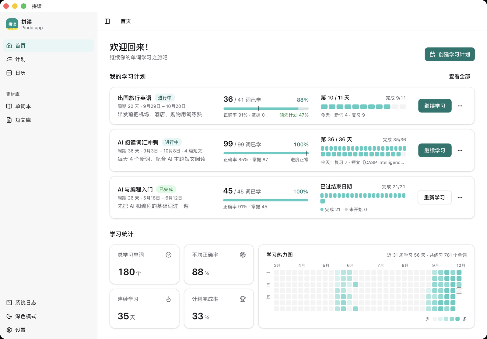
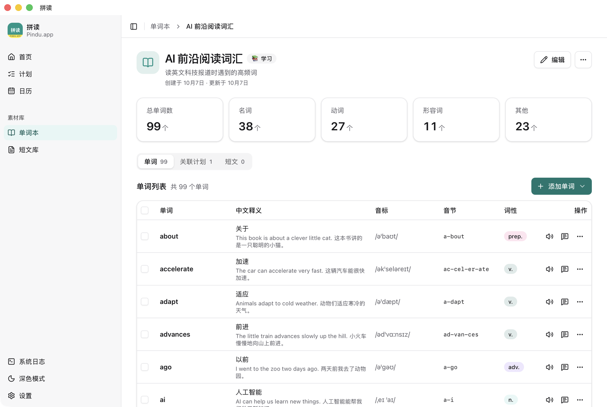
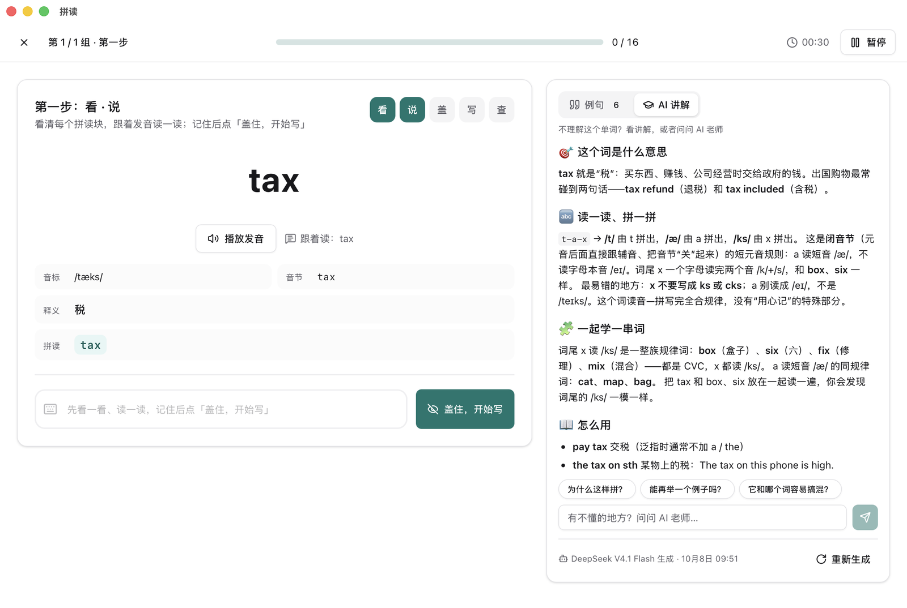
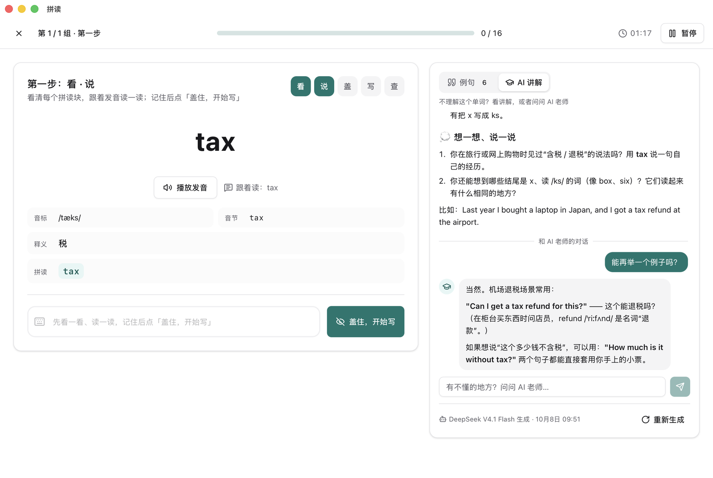
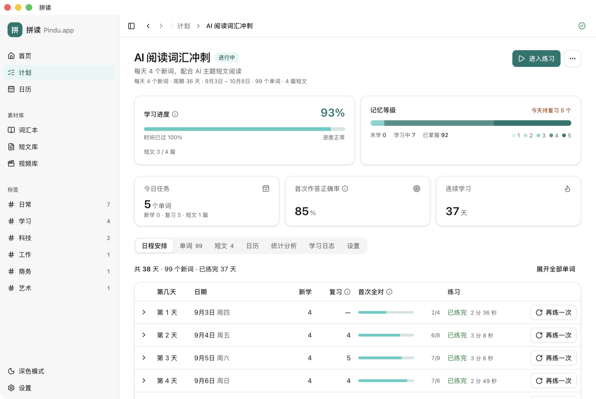
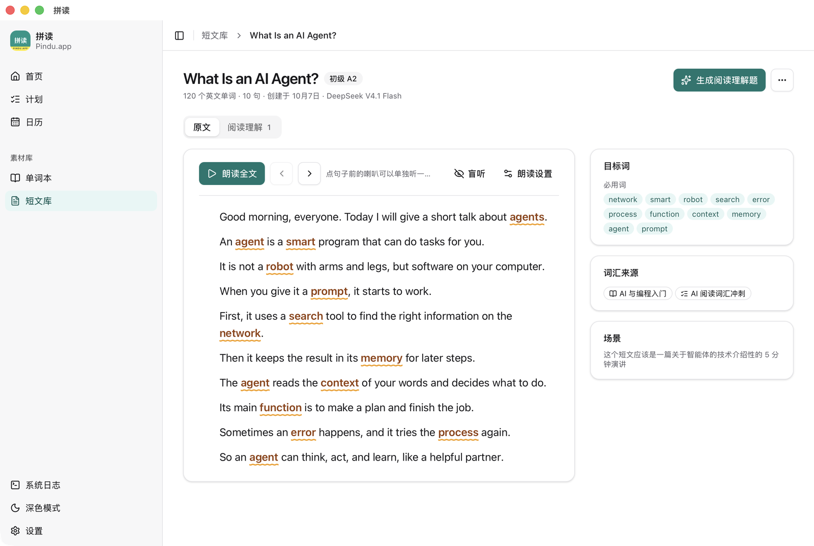

# 拼读（Pindu.app）

[English](./README.en.md) · [安装](./INSTALL.md) · [参与开发](./CONTRIBUTING.md) · [安全与隐私](./SECURITY.md)

拼读是一个背英语单词的桌面应用，核心是自然拼读：先把单词拆成几个拼读块（比如 luggage 拆成 lug · gage），看清每一块怎么发音，再去记意思和拼写。比起整个词硬背，这样记得快，也忘得慢。除了单词，也收词组（give up、pick sb up 这类），还能把单词放回短文和视频片段里学。讲解的深浅按学习者设置来，可以选小学生、中学生或成人。

应用跑在 macOS、Windows 和 Linux 上。所有数据都存在你自己电脑里，不用注册账号；AI 和发音用的是你自己申请的 API Key。



## 单词从哪来

新建一个词汇本，写一句它是干什么用的（比如「带宠物看兽医」），AI 就按这个场景给出几条词汇需求建议，选几条直接生成单词表；也可以自己描述想学什么，或者一个个手动录入。如果手头有课文、字幕或文章，把文件拖进来（txt、md、srt、vtt、docx、pdf 都行），它会把里面的生词和值得整体记的词组挑出来。

每个词进词汇本后，AI 会补全音标、音节、拼读拆分和几条由易到难的例句；词组会标出类型（短语动词、固定搭配、习语）和能不能拆开用。不满意可以再补几句，或者整个重新生成。词汇本、短文和视频可以打标签，侧边栏按标签把相关素材归到一起。



## 怎么练

建一个学习计划：选好词汇本，定每天学几个新词，日程就排好了。

每个新词分三步练。第一步把拼读块、音标、释义、例句全摆出来，看清楚、跟着读；第二步把英文盖住，凭记忆写；第三步只给中文和发音，从头拼出来。


哪个词记不住，就点单词卡上的「AI 老师」。可以让它把这个词讲透：什么意思，为什么这么拼，同一个拼读规律下还有哪些词，平时怎么用，容易和哪个词搞混，有什么好记的办法；也可以接着问，比如「能再举一个例子吗？」。讲解的深浅和详略跟着学习者设置走。

<table><tr>
<td width="50%"></td>
<td width="50%"></td>
</tr></table>

复习不用自己操心。每个词有一个记忆等级，间隔从 1 天、3 天、7 天一路拉长到 30 天；答对就往后推，答错第二天再练。每天该复习哪些词，打开应用就已经放进今天的任务里了。计划临时要停几天也没关系，暂停之后再继续，后面的日程会自动顺延。



## 把单词放回文章里

光背单词表容易背了就忘，所以加了短文。选一批学过的词，AI 会先想好怎么安排内容，再按你的水平写成短文，附上逐句翻译；也可以导入你自己的英文材料，原文一个字不改，只补翻译和难度标注。

读的时候目标词会标出来，点一下就是它的单词卡；读到看不懂的句子，可以打开「句子分析」，看句式、成分、语法点和这句话在交流里的作用，再就这句问老师。可以一句句朗读，也可以盖住原文只听；朗读的音色和风格（老师示范、自然口语、讲故事等）在设置里选。读完能出一套阅读理解：选词填空、选择题、判断题自动判分，开放题由 AI 打分并给出改进建议。短文也能加进学习计划，隔几天安排一篇。



## 从视频里学

导入一部视频和它的字幕，AI 会按场景规划怎么切成一段段短片，你可以在剪辑编辑器里预览、拖动调整，确认后切出来。每个片段都能看台词学、跟读录音、听一句拼一句，也能加进学习计划。在视频库里输入一个英文词，能找出所有视频里说过它的片段。视频处理用的 ffmpeg 随应用自带，不用另外安装。

<sub>以上截图用的是演示数据。</sub>

## 安装

到 [Releases 页面](https://github.com/abbish/pindu/releases) 下载对应系统的安装包：macOS 用 `.dmg`，Windows 用 `-setup.exe`，Linux 用 AppImage、deb 或 rpm。应用没有做苹果和微软的开发者签名，第一次打开时系统会拦一下，放行一次就好，具体步骤见 [INSTALL.md](./INSTALL.md#1-下载安装包)。以后出了新版本，应用会在窗口顶部提示，点一下就能更新，更新包要先校验签名才会安装。

装好之后去设置里填 API Key：AI 部分支持任何 OpenAI 兼容的接口，内置了 OpenRouter、MiniMax、月之暗面和 DeepSeek；发音用的是火山引擎的豆包语音合成。不填 Key 也能手动建词汇本、练习和看统计，只是用不了 AI 和发音。

详细步骤、升级方法和常见问题都在 [INSTALL.md](./INSTALL.md)。想自己编译打包，看 [CONTRIBUTING.md](./CONTRIBUTING.md#本地打包)。

## 隐私

拼读没有服务器，也不收集任何使用数据。会联网的只有两种情况：一是用到 AI 或发音时，把相关内容（单词、句子、你导入的材料、你写的答案）直接发给你自己配置的服务商；二是检查更新时访问 GitHub，看有没有新版本，这个可以在设置里关掉。API Key 以明文存在本机数据库里，不会写进日志。具体见 [SECURITY.md](./SECURITY.md)。

## 开发

```bash
npm install
npm run agent:install   # 第一次需要：安装内置 AI 助手的依赖
npm run tauri:dev       # 开发模式
npm run verify          # 提交前跑一遍：静态检查和前后端测试
```

界面是 React 19 + shadcn/ui + Tailwind CSS v4，桌面壳用 Tauri 2，后端是 Rust 加 SQLite。所有 AI 功能都交给一个内置的 agent 进程（基于 [pi](https://www.npmjs.com/package/@earendil-works/pi-coding-agent)，用 Bun 编译成单个可执行文件）。模型的输出要先过工具校验，Rust 这边再按输入核对一遍，比如拼读分析只收下请求里的那些词，漏掉的会补上。

代码怎么分层、数据库有哪些表、每个 AI 任务怎么跑，都写在 [CLAUDE.md](./CLAUDE.md) 里。这份文档同时也是给 AI 编程助手看的说明，内容以代码现状为准。内置 agent 的设计见 [docs/agent-harness/](./docs/agent-harness/DESIGN.md)。

发现问题或者有想法，欢迎提 [Issue](https://github.com/abbish/pindu/issues)；想直接改代码的话，先看一下 [CONTRIBUTING.md](./CONTRIBUTING.md)。安全问题请不要公开提，按 [SECURITY.md](./SECURITY.md) 私下联系。

## 许可证

[MIT](./LICENSE) © 2023-2026 abbish and RedLark contributors
